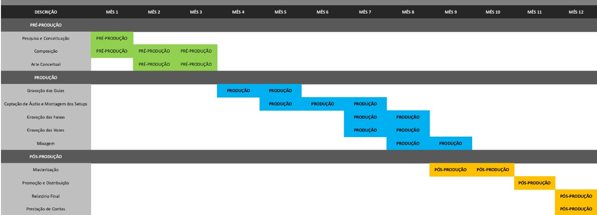

	Nosllyah & Orí (Album 2024)

>  ⚠️ 
> Nenhuma informação sensível deve estar contida nesse site. Caso alguma informação dessa natureza se encontre disposta dentre essas informações, favor entre em contato com os responsáveis.
>> Email: nosllyah.music@gmail.com

## Resumo do Projeto:

O projeto Agouro, é uma iniciativa voltada para o desenvolvimento de um álbum musical com oito faixas. Este trabalho será realizado pelos músicos e produtores musicais Nosllyah (Ailson Guedes) e Orí (Dante José), utilizando influências da música eletrônica/experimental e do rock n´roll.
 
Essa fusão pretende viabilizar a produção de um trabalho completamente novo, envolto em processos e descobertas que se comunicam com lendas do Recôncavo Baiano. Utilizando conceitos que permeiam lendas regionais e um particular universal contido nos trabalhos desses produtores, este álbum se propõe a vestir roupagem totalmente experimentalista, propondo uma mescla de ritmos e texturas, tão fortes e significativas em nosso território de identidade.

## Descrição:

O projeto Agouro conta com oito músicas que nascem da pesquisa e do reencontro cultural que os produtores farão com suas raízes, trazendo partes da cultura do recôncavo baiano e apresentando em um novo universal. O projeto desenvolverá uma pesquisa estética e sonora, juntando a regionalidade, que terá o papel de plano de fundo e dará o panorama do produto artístico final, com o universal particular encontrado nos trabalhos pregressos de cada um dos produtores envolvidos.

Em toda a sua proposta, visamos apresentar o universo que as lendas regionais do recôncavo guardam. Buscamos pensar os enredos dessas histórias como uma trilha sonora que tenta se expressar em paisagens musicais surrealistas, beirando o horror cósmico das artes visuais.  Englobando o "saber antigo", preservando e passando para as futuras gerações em uma nova proposta.
 
A proposta contará não só com sua difusão artística feita em áudio, mas também, com material visual postado nas redes sociais (Instagram e Youtube). Para esse material contaremos com intérprete de libras e/ou legenda. Serão seis vídeos tutoriais mostrando um pouco sobre o dia-a-dia de produção e os programas que utilizamos para fazer música. Buscando assim uma ponte com um público, que encontrará nesse trabalho um material que respeita e busca abrir novas possibilidades para aqueles que pretendem entrar no mundo da música.

A música é uma forma poderosa de expressão artística, com o potencial de impactar positivamente a sociedade em que vivemos. Este projeto busca contribuir para o enriquecimento cultural e artístico, bem como para a diversificação da cena musical local e nacional.

O álbum proposto buscará explorar novas fronteiras musicais e transcender os limites dos gêneros tradicionais. Isso promove a inovação artística e enriquece o cenário musical. Ao incorporar influências culturais variadas, contribuirá para a promoção da diversidade cultural e celebrará a riqueza da expressão artística global. Além de tudo, o projeto também oferecerá oportunidades de desenvolvimento profissional para os artistas participantes.

## Objetivos:

1. Gravar, mixar e masterizar um álbum de alta qualidade que incorpore elementos de diferentes gêneros musicais, demonstrando nossa criatividade e habilidade técnica.

2. Exploração Artística: Explorar novos territórios musicais, desafiando convenções e criando uma experiência auditiva única para o público.

3. Promoção e Distribuição: Desenvolver uma estratégia de promoção e distribuição eficaz para garantir que o álbum alcance um público amplo, tanto local como internacionalmente.

4. Impacto Cultural: Contribuir para a diversidade musical e o enriquecimento cultural, elevando a música autoral a um novo patamar de reconhecimento e apreciação.

5. Avaliação e Métricas: Estabelecer métricas de sucesso para avaliar o impacto do projeto, incluindo o número de streams e feedback da audiência.o.
   
## Cronograma: 

## Perfil do público a ser atingido pelo projeto:

A partir dos nossos levantamentos, acreditamos que a maior parte do público diretamente atigido por esse projeto sejam jovens-adultos, com suas idades entre 17 à 40 anos, com gosto musical direcionado a gêneros como: eletrônica (IDM, Electro-Experimental, Lo-Fi e afins), rock alternativo ou música experimental. Porém existe a grande possibilidade de se atingir ainda mais pessoas.
 

Além disso, por conta de trabalhos lançados anteriormente pelos produtores envolvidos, que já contam com um alcance internacional, o projeto pode também atingir um vasto público fora do país.

## Metas: liste em itens cada atividade ou produto, quantidade e estimativa de público:

1. Produzir um álbum de 8 faixas;

2. Fazer um trabalho de resgate cultural acerca das lendas do recôncavo;

3. Produzir seis vídeos tutoriais afim de fomentar o incentivo a produção musical;

4. Gerar renda para os profissionais do recôncavo através da prestação de serviço.

## Informe como essas medidas de acessibilidade indicadas serão implementadas ou disponibilizadas de acordo com o projeto proposto:

Todo material de vídeo disponibilizado pelo projeto virá acompanhado de Legendas e/ou Intérprete de Libras.

## Local onde o projeto será executado:

O projeto será executado de forma 100% online. Sendo apresentado ao público através das mídias sociais e streamings de música. 

## Roteiro de execução: lista em itens os passos a serem seguidos, data de início e de fim:

* Pré-Produção:
  1. Contratação de Equipe e Reunião de Planejamento Inicial | início 01/01/2024 - fim 31/01/2024.
  2. Arte Conceitual | 01/01/2024 - fim 31/02/2024.
  3. Roteiro & Storyboard | 01/01/2024 - fim 29/02/2024.

* Produção:
  1. Ilustração | 01/03/2024 - fim 31/08/2024.
  2. Arte da Capa e Projeto Gráfico | 01/04/2024 - fim 31/05/2024.
  3. Diagramação | 01/08/2024 - fim 30/09/2024.
  4. Arte Final e Impressão | 01/09/2024 - fim 31/10/2024.

* Pós-Produção:
  1. Publicação | 01/10/2024 - fim 31/10/2024.
  2. Promoção | 01/10/2024 - fim 31/12/2024.
  3. Relatório Final | 01/12/2024 - fim 31/12/2024.
  4. Prestação de Contas | 01/12/2024 - fim 31/12/2024.

## Equipe envolvida: Listar os nomes dos profissionais beneficiados diretamente com o projeto, com as informações: nome, função, CPF ou CNPJ, valor da remuneração, se pessoa negra, pessoa indígena ou pessoa com deficiência:
>Exemplo: "1. Nome do profissional - Função - CPF/CNPJ - Valor da remuneração - Pessoa negra / Pessoa indígena ou Pessoa com deficiência."

- Ailson Guedes Da Fonseca (Nosllyah) - Função: proponente, produtor musical, músico e compositor - CPF: xxx.xxx.xxx-xx - Valor da Remuneração: R$ x.xxx,xx - Pessoa Negra

- Dante José Mendes de Jesus Santana (Orí) - Função: produtor musical, músico e compositor - CPF: xxx.xxx.xxx-xx - Valor da Remuneração: R$ x.xxx,xx - Pessoa Negra

- Ruanne Inácia Borba Baião - Função: Social Mídia  - CPF: xxx.xxx.xxx-xx - Valor da Remuneração: R$ x.xxx,xx- Pessoa Negra

- Fulano1 - Função: Design  - CPF: xxx.xxx.xxx-xx - Valor da Remuneração: R$ x.xxx,xx - Pessoa Negra

## Currículo do proponente:

* Portfólio Nosllyah
  <a target="_blank">.pdf)</a>

## Currículo da equipe envolvida:

* Portfólio Orí
  

* Portfólio Ruanne
  

## Estratégia de divulgação: apresente um plano de mídia em conformidade com o disposto no item 18 do Edital:

## Descreva e detalhe a ação de contrapartida a ser desenvolvida, indicando público alvo, conceito, estrutura, etc:

## Indique quando será a realização:

Entre o mês de Janeiro e o mês de Dezembro, do ano de 2024 (dois mil e vinte e quatro)

## Indique o local de realização:

 Todo o projeto será realizado de forma online, tendo o material produzido, disponibilizado nas mídias sociais e nas principais plataformas de streaming de música.

- - -
- - - 
## Outros Materiais:

A música é uma forma poderosa de expressão artística, com o potencial de impactar positivamente a sociedade em que vivemos. Este projeto busca contribuir para o enriquecimento cultural e artístico, bem como para a diversificação da cena musical local e nacional.
 
Inovação Artística: O álbum proposto buscará explorar novas fronteiras musicais e transcender os limites dos gêneros tradicionais. Isso promove a inovação artística e enriquece o cenário musical.

Diversidade Cultural: Ao incorporar influências culturais variadas, o álbum contribuirá para a promoção da diversidade cultural e celebrará a riqueza da expressão artística global.

Potencial de Impacto: A música tem o poder de inspirar, unir e emocionar as pessoas. Este álbum tem o potencial de impactar positivamente os ouvintes, proporcionando uma experiência musical única.

Desenvolvimento de Carreira: O projeto também oferecerá oportunidades de desenvolvimento profissional para os artistas, incluindo colaborações com outros músicos, produtores e profissionais da indústria.

Esses são alguns dos principais pontos pelos quais acreditamos que o projeto é relevante e merece apoio para sua realização.

A música é uma forma poderosa de expressão artística, com o potencial de impactar positivamente a sociedade em que vivemos. Este projeto busca contribuir para o enriquecimento cultural e artístico, bem como para a diversificação da cena musical local e nacional.

1. Inovação Artística: O álbum proposto buscará explorar novas fronteiras musicais e transcender os limites dos gêneros tradicionais. Isso promove a inovação artística e enriquece o cenário musical.
2. Diversidade Cultural: Ao incorporar influências culturais variadas, o álbum contribuirá para a promoção da diversidade cultural e celebrará a riqueza da expressão artística global.
3. Potencial de Impacto: A música tem o poder de inspirar, unir e emocionar as pessoas. Este álbum tem o potencial de impactar positivamente os ouvintes, proporcionando uma experiência musical única.
4. Desenvolvimento de Carreira: O projeto também oferecerá oportunidades de desenvolvimento profissional para os artistas, incluindo colaborações com outros músicos, produtores e profissionais da indústria.

## Referências Musicais:

* [J Albert - Flat Earth](https://open.spotify.com/intl-pt/album/0Qx7587Va1Auh1OjFI4RnX?si=jx9K_Z67SEGIG4MnKc-EKA)

* [Atoms For Peace - Amok](https://open.spotify.com/intl-pt/artist/7tA9Eeeb68kkiG9Nrvuzmi?si=9034b28785a9483f)

* [Teebs - Collections 01](https://open.spotify.com/intl-pt/album/6MfmIuNJmgLZ0kGE5ot8vi?si=pJtUu80tTcKdmOXsk6Ak0A)

* [Boards Of Canadá - Music Has The Right To Children](https://open.spotify.com/intl-pt/album/6LZiNXaDvhzvnXUubVOmNU?si=mzYdm_VbS-uTv3779fnn9Q)
